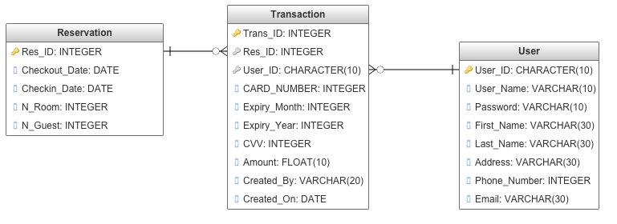

# A Hotel Reservation System for The Dan's Den 

This hotel reservation system allows users to reserve a room at Hotel Dan's Den online by self service mode for filling in guest details and making payments.
It allows the guest to create an account for reusing contact information in future or make reservation as guest without creating an account. While booking users have the option to override the auto-filled contact information. 
All the booking history can be retrieved through booking history button.
The booking can be cancelled by entering the reservation ID.
The primary key for transaction ID is an unique auto generated alphanumeric key.

# Entity Relationship Diagram 

The transaction table has Reservation ID and User ID as foreign key as shown above.
